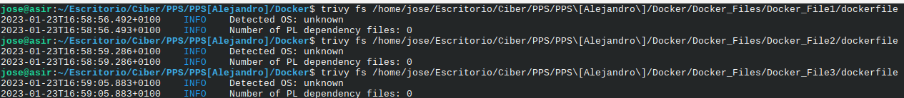
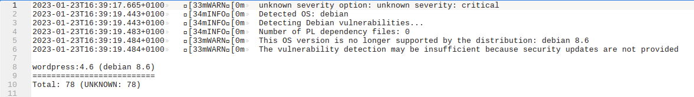
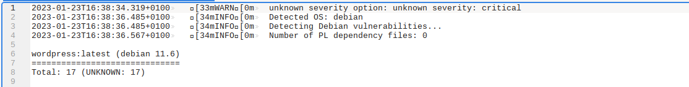

# Primera parte 
~~~
[WARN] 4.6 - Ensure that HEALTHCHECK instructions have been added to container images (Automated) 
~~~
~~~
[WARN]      * No Healthcheck found: [wordpress:latest]
~~~

Este warn nos indica que no se comprueba el nivel de salud de un contenedor activo. Por lo que no sabriamos si de repente ha surgido un problema el cual comprometa el funcionamiento del contenedor. 

Un ejemplo sería un servidor apache que se cae pero como el contenedor sigue corriendo tu no te darias cuenta, pero con el Healthcheck nos avisaria de esto.

Para poder arreglar este warning sera necesario añader el comando Healthcheck en el dockerfile y en el docker-compose 	
~~~
[WARN] 2.15 - Ensure live restore is enabled (Scored)
~~~
Este warn nos indica que no esta habilitada la restauración en vivo, esto sirve para que cuando tenemos que reiniciar el daemon de docker el contenedor siga en ejecución para que cuando vuelva a estar habilitado el daemon tarde menos en poder volver a estar activo el conjunto.
	
    
Esta opcion se puede habilitar en el archivo de configuración del Docker Daemon que por defecto en Linux es etc/docker/daemon.json y ponemos esto en el archivo de configuración.

~~~
{

  "live-restore": true

}
~~~

# Segunda Parte

Aqui no me ha salido ningun problema de dependencia

# Tercera Parte
He utilizado el trivy y he seleccionado que me muestre los resultados de severidad critica, y como se puede ver la ultima version tiene 17 vulnerabilidades criticas y la versión 4.6 tiene 78, una diferencia bastante grande

Todas las vulnerabilidades que tiene el wordpress:latest las tiene el wordpress:4.6 pero no viceversa ya que el wordpress:4.6 tiene muchos mas cosas tales como DLAs y DSAs los cuales indican que han habido actualizaciones de seguridad sobre esos servicios y que no estan aplicados, como por ejemplo ca-certificates y el login y passwd.

|
\
|-> Este es el wordpress:4.6

|
\
|-> Este es el wordpress:latest
